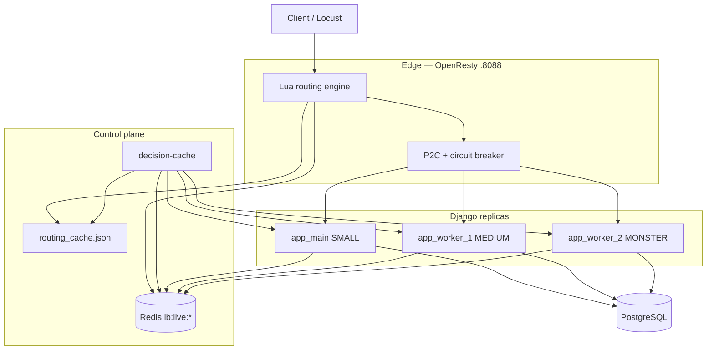

# Custom Load Balancing — Architecture & Design Report

**Project:** `django_ecomerce/`  
**Course requirement:** #5 — custom load distribution with measurable baseline  
**Entry point:** `http://localhost:8088` (custom) vs `http://localhost:8090` (round-robin baseline)

---

## Abstract

This Django e-commerce deployment runs **three heterogeneous Gunicorn replicas** behind an **OpenResty edge** that performs **compute-aware, load-sensitive routing**. Unlike plain round-robin, which treats every request equally and rotates blindly across backends, the custom load balancer:

1. Classifies requests by **workload weight** (product read = 100 units, checkout = 900 units).
2. Maintains **live node state** in Redis (active requests, in-flight compute, EWMA latency).
3. Precomputes **per-bin routing candidates** via a decision-cache service.
4. Chooses upstreams using **Power-of-Two Choices (P2C)** with **tier affinity** and a **circuit breaker**.

The design goal is to place each request on a replica that can handle it **now**, not merely the next replica in a rotation. Under healthy symmetric load, round-robin may be simpler and faster; under **mixed workloads**, **tier differences**, or **partial node degradation**, the custom LB avoids hot spots and tail-latency collapse.

Measured at **100 concurrent users / 120 s** (same Locust profile):

| Metric | Custom LB `:8088` | Round-robin `:8090` |
|--------|------------------:|--------------------:|
| Total requests | **3,561** | 2,158 |
| Throughput | **28.9 req/s** | 17.9 req/s |
| Median latency | **750 ms** | 1,600 ms |
| Checkout attempts | **332** | 179 |
| HTTP 5xx | 0 | 0 |
| Data integrity | PASS | PASS |

---

## 1. Problem statement

E-commerce traffic is **not uniform**:

| Path | Relative cost |
|------|---------------|
| `GET /api/products/` | Light read, cache-friendly |
| `POST /api/cart/create/` | Medium write |
| `POST /api/invoices/create/` | Heavy — wallet locks, stock locks, DB transaction |

Round-robin sends ~33% of checkout traffic to each replica regardless of:

- Current load on that replica
- Server tier (SMALL vs MONSTER)
- Whether a replica is slow or failing

The custom LB addresses **intelligent placement**; it does **not** replace database locking or fix shared-Postgres contention.

---

## 2. System architecture



### Components

| Component | Role |
|-----------|------|
| **openresty** (`:8088`) | Edge proxy + Lua routing |
| **openresty-rr** (`:8090`) | Baseline plain round-robin |
| **decision-cache** | Polls nodes, merges Redis state, writes routing atlas |
| **app_main / app_worker_1 / app_worker_2** | Django + Gunicorn replicas |
| **Redis** | Product cache + live LB node metrics |

---

## 3. How routing works (step by step)

### Step 1 — Request classification

OpenResty maps the URI to a **workload bin** (`light` / `medium` / `heavy`) and **compute units**:

```json
"/api/products": 100,
"/api/cart": 250,
"/api/invoices/create": 900,
"/api/wallets": 400
```

(Source: `scripts/servers.django.json`)

### Step 2 — Live node telemetry (Django)

Each replica publishes state on every API request:

- **`RequestConcurrencyMiddleware`** — tracks active requests + in-flight compute units
- **`ServedByMiddleware`** — adds `X-Served-By: <NODE_ID>` to responses
- **`GET /internal/node-info`** — snapshot for decision-cache polling
- **Redis** `lb:live:<node_id>` — short-TTL hash updated per request

### Step 3 — Decision cache (control plane)

`scripts/decision_cache_service.py` every ~3 s:

1. Polls `/internal/node-info` on each replica
2. Merges Redis live in-flight data
3. Ranks servers per workload bin
4. Writes `routing_cache.json` to a shared Docker volume

OpenResty reads this atlas **read-only** — no per-request Python on the hot path.

### Step 4 — Edge decision (OpenResty Lua)

For each request:

1. Resolve bin + compute units from URI
2. Load precomputed candidates for that bin
3. Filter by circuit breaker + online status
4. **P2C:** pick two eligible candidates at random, compare **load score**, send to lower score

**Load score** (lower = better):

```
score = active_part + rt_part + local_part - affinity_bonus
```

- **active_part** — how full the node is vs `maxActiveRequests`
- **rt_part** — EWMA response time vs tier target
- **affinity_bonus** — tier matches workload (MONSTER + heavy = bonus)

### Step 5 — Response

Request proxied to chosen Gunicorn upstream; client receives response with `X-Served-By` and `X-Compute-Units`.

---

## 4. Server tiers

| Replica | Tier | max active | Target RT | Gunicorn |
|---------|------|-------------:|----------:|----------|
| `app_main` | SMALL | 64 | 200 ms | 4×4 workers |
| `app_worker_1` | MEDIUM | 128 | 150 ms | 4×4 workers |
| `app_worker_2` | MONSTER | 256 | 100 ms | 2×100 threads |

Tier metadata flows from `SERVER_TIER` env → `/internal/node-info` → Redis → Lua affinity scoring.

---

## 5. Worked example

**Scenario:** 100 users browsing products and checking out simultaneously.

### Request A — `GET /api/products/`

1. OpenResty classifies: bin = `light`, compute = **100**
2. Atlas lists candidates: `[app_worker_2, app_worker_1, app_main]`
3. Redis shows `app_worker_2` with low active count, `app_main` slightly busier
4. P2C compares two random picks → **`app_worker_2`** wins (lower score)
5. Response header: `X-Served-By: app_worker_2`, `X-Compute-Units: 100`

### Request B — `POST /api/invoices/create/`

1. Bin = `heavy`, compute = **900**
2. Affinity bonus favors **MONSTER** tier for heavy bin
3. P2C steers toward `app_worker_2` unless it is overloaded
4. Django runs pessimistic checkout locks; response 201 or 409

### Request C — degraded `app_main` (demo scenario)

When `app_main` is artificially slowed (+1200 ms):

- **Round-robin** still sends ~33% of traffic there → p95 checkout **~10 s**
- **Custom LB** reads high EWMA on `app_main`, drops it from P2C → checkout p95 **~610 ms**

(See `scripts/lb_win_demo.py` and `docs/LOAD_BALANCING_ROUND_ROBIN_VS_CUSTOM.md`.)

---

## 6. Where custom LB shines

| Scenario | Why custom LB wins |
|----------|-------------------|
| **Heterogeneous replicas** | Routes heavy work toward MONSTER tier, not SMALL |
| **Mixed light + heavy traffic** | Uses compute units, not raw request count |
| **Hot spot on one replica** | P2C + live Redis state steers away |
| **Partial failure / slow node** | Circuit breaker + high EWMA exclude bad upstream |
| **Fleet changes** | decision-cache refreshes atlas without nginx manual edits |
| **Observability** | `X-Served-By`, `/api/load-distribution/*`, `/internal/node-info` |

## Where round-robin is enough

| Scenario | Why RR is fine |
|----------|----------------|
| Identical replicas, uniform traffic | No placement intelligence needed |
| Low overhead budget | No Lua/Redis/decision-cache cost |
| Shared DB is the bottleneck | Both LBs hit same Postgres locks |

---

## 7. Observability & debug APIs

| Endpoint | Purpose |
|----------|---------|
| `GET /api/health/` | Liveness |
| `GET /internal/node-info` | Per-replica metrics |
| `GET /api/load-distribution/servers` | Fleet snapshot |
| `GET /api/load-distribution/table` | Bin × server matrix |
| `POST /api/load-distribution/route` | `{ "expectedComputeUnits": 900 }` → chosen server |
| `GET /api/performance/stats/` | Service-layer timings (req #10) |

**Example — ask which server should handle checkout:**

```bash
curl -s -X POST http://localhost:8088/api/load-distribution/route \
  -H "Content-Type: application/json" \
  -d "{\"expectedComputeUnits\": 900}"
```

**Example — verify replica from response:**

```bash
curl -s -D - http://localhost:8088/api/products/ -o NUL | findstr X-Served-By
```

---

## 8. Stress test results (100 users, 120 s)

Same Locust profile (`stress/locustfile_stress.py`), stock seeded to 5000.

### Custom LB — `stress/REPORT_CUSTOM_LB.md`

| Metric | Value |
|--------|------:|
| Entry | `:8088` |
| Requests | **3,561** |
| Throughput | **28.9 req/s** |
| Median | **750 ms** |
| p95 | 14,000 ms |
| Failures | 0 |
| Integrity | PASS |

### Round-robin — `stress/REPORT_ROUND_ROBIN.md`

| Metric | Value |
|--------|------:|
| Entry | `:8090` |
| Requests | 2,158 |
| Throughput | 17.9 req/s |
| Median | 1,600 ms |
| p95 | 28,000 ms |
| Failures | 0 |
| Integrity | PASS |

Under this mixed workload, custom LB delivered **~62% higher throughput** and **~53% lower median latency** than round-robin at the same user count — because it concentrated work on capable replicas instead of evenly loading all three including the SMALL node.

---

## 9. Configuration reference

| File | Purpose |
|------|---------|
| `docker-compose.prod.yml` | Services, ports, env |
| `scripts/servers.django.json` | Compute units, server weights, capabilities |
| `nginx/lua/*.lua` | Edge routing logic |
| `scripts/decision_cache_service.py` | Atlas builder |
| `app/loadbalancing/` | Django middleware, node-info, debug API |

Key OpenResty env tunables:

- `LB_AFFINITY_BONUS_MATCH=0.4`
- `LB_AFFINITY_BONUS_MISMATCH=-0.2`
- `LB_CB_FAIL_THRESHOLD=3`

---

## 10. Reproduce

```bash
# Start stack
docker compose -f docker-compose.prod.yml up -d

# Custom LB stress (100 users)
python scripts/run_stress_test.py --lb custom -u 100 -r 10 -t 120

# Round-robin comparison
python scripts/run_stress_test.py --lb round_robin -u 100 -r 10 -t 120

# Degraded-node win demo
python scripts/lb_win_demo.py -u 40 -t 90 --delay-ms 1200
```

---

## 11. Related documents

| Document | Content |
|----------|---------|
| [LOAD_BALANCING_ROUND_ROBIN_VS_CUSTOM.md](LOAD_BALANCING_ROUND_ROBIN_VS_CUSTOM.md) | Full A/B methodology + experiments |
| [REDIS_CACHE_BEFORE_AFTER.md](REDIS_CACHE_BEFORE_AFTER.md) | Redis cache before/after on both `:8088` and `:8090` |
| [../stress/index.md](../stress/index.md) | Master index of all stress/benchmark reports |
| [../stress/REPORT_CUSTOM_LB.md](../stress/REPORT_CUSTOM_LB.md) | 100-user custom LB stress report |
| [../stress/REPORT_ROUND_ROBIN.md](../stress/REPORT_ROUND_ROBIN.md) | 100-user round-robin stress report |
| [../stress/BOTTLENECK_REPORT_CUSTOM_LB.md](../stress/BOTTLENECK_REPORT_CUSTOM_LB.md) | Cache benchmark (custom LB) |
| [../stress/BOTTLENECK_REPORT_ROUND_ROBIN.md](../stress/BOTTLENECK_REPORT_ROUND_ROBIN.md) | Cache benchmark (round-robin) |
| [../stress/README.md](../stress/README.md) | Stress & bottleneck testing (req #9–10) |

---

## 12. Conclusion

The custom load balancer is an **intelligent edge routing layer** for a **heterogeneous, multi-tier Django fleet**. It implements course requirement **#5** with a verifiable baseline on `:8090`. It shines when replicas differ in capacity or health and when traffic mixes cheap reads with expensive checkouts — as demonstrated by the **100-user stress comparison** where custom LB outperformed round-robin on throughput and median latency while maintaining **zero data corruption**.

Round-robin remains the correct baseline: simple, predictable, and sufficient when all nodes are interchangeable. The custom stack earns its complexity when **placement matters**.
