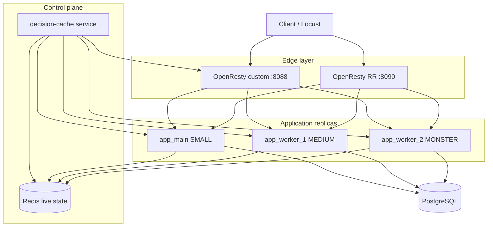
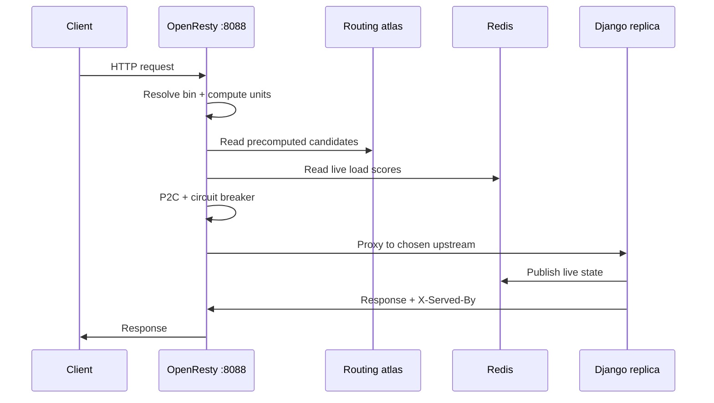
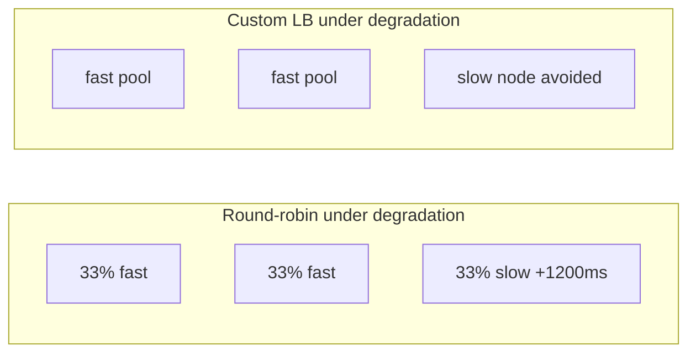

# Load Balancing: Round-Robin vs Custom (A–Z)

This document describes the Django e-commerce load-balancing stack from end to end: what round-robin does, what the custom OpenResty load balancer does, how they were compared, and when each approach wins.

**Project:** `django_ecomerce/`  
**Course requirement:** #5 — custom load balancing with a measurable baseline for comparison.

---

## Table of contents

1. [Executive summary](#1-executive-summary)
2. [Problem statement](#2-problem-statement)
3. [Architecture overview](#3-architecture-overview)
4. [Round-robin baseline](#4-round-robin-baseline)
5. [Custom load balancer](#5-custom-load-balancer)
6. [Server tiers and compute units](#6-server-tiers-and-compute-units)
7. [Request path (step by step)](#7-request-path-step-by-step)
8. [Observability](#8-observability)
9. [Benchmark methodology](#9-benchmark-methodology)
10. [Experiment 1 — fair symmetric workload](#10-experiment-1--fair-symmetric-workload)
11. [Experiment 2 — degraded node + checkout-heavy load](#11-experiment-2--degraded-node--checkout-heavy-load)
12. [Round-robin vs custom — decision matrix](#12-round-robin-vs-custom--decision-matrix)
13. [Limitations and caveats](#13-limitations-and-caveats)
14. [How to reproduce](#14-how-to-reproduce)
15. [Conclusion](#15-conclusion)

---

## 1. Executive summary

We run **three identical Django/Gunicorn replicas** behind two different edge entry points:

| Entry | Port | Strategy |
|-------|------|----------|
| **Custom LB** | `http://localhost:8088` | OpenResty + Lua + affinity bins + P2C + live Redis state + decision-cache |
| **Round-robin** | `http://localhost:8090` | Plain nginx upstream rotation (baseline) |

**Key finding:** Neither strategy is universally “better.” They optimize for different goals.

- **Round-robin wins** when replicas are similar, traffic is mixed but not extreme, and the real bottleneck is shared infrastructure (PostgreSQL, Redis). The custom stack adds routing overhead without enough benefit.
- **Custom LB wins** when at least one replica is slow or overloaded and traffic includes heavy endpoints (checkout). The custom stack detects load, avoids bad nodes, and keeps tail latency (p95) under control.

Both conclusions were measured with Locust under controlled Docker conditions (see [§9–§11](#9-benchmark-methodology)).

---

## 2. Problem statement

An e-commerce API serves requests with very different cost:

- `GET /api/products/` — cheap read, cache-friendly
- `POST /api/invoices/create/` — expensive: wallet locks, stock locks, DB transaction

Sending every request to the next replica in rotation treats a product browse the same as a checkout. That is simple and fast to operate, but it fails when:

1. Replicas have **different capacity** (small vs large instances).
2. One replica becomes **slow or unhealthy**.
3. **Heavy traffic** (checkout spikes) collides with light traffic on the same node.
4. You need **SLA-aware** placement (keep p95 checkout latency bounded).

The custom load balancer addresses these cases. Round-robin remains the honest baseline: minimal logic, minimal overhead.

---

## 3. Architecture overview



### Docker services (`docker-compose.prod.yml`)

| Service | Role |
|---------|------|
| `app_main` | Django + Gunicorn, `NODE_ID=app_main`, tier **SMALL** (4 workers × 4 threads) |
| `app_worker_1` | Same app, tier **MEDIUM** (4×4) |
| `app_worker_2` | Same app, tier **MONSTER** (2 workers × 100 threads) |
| `decision-cache` | Polls `/internal/node-info`, merges Redis live metrics, writes routing atlas |
| `openresty` | Custom LB on port **8088** |
| `openresty-rr` | Round-robin baseline on port **8090** |
| `redis` | Product cache + LB live node state |
| `db` | PostgreSQL (shared by all replicas) |
| `locust` | Load testing UI on port **8089** |

All replicas run the **same codebase** and share the **same database**. Load balancing affects *which replica handles a request*, not business logic.

---

## 4. Round-robin baseline

### What it is

The `openresty-rr` container uses a standard nginx upstream block with three backends (`app_main`, `app_worker_1`, `app_worker_2`). Each new request goes to the **next** server in the list.

### Properties

| Aspect | Behavior |
|--------|----------|
| Request awareness | None — checkout and product read are equal |
| Node health | Basic upstream fail-over only (if configured) |
| Capacity tiers | Ignored |
| Per-request overhead | Very low |
| Distribution | ~33% / ~33% / ~33% at steady state |

### When it is the right tool

- Homogeneous replicas (same CPU/RAM/workers).
- Uniform or mildly mixed traffic.
- Simplicity and throughput matter more than tail latency on heavy paths.
- Shared DB is the bottleneck (LB cannot fix row-level locking).

### Verified behavior

Under product-list sampling, round-robin produced an even split:

```
app_main: 30, app_worker_1: 30, app_worker_2: 30  (90 requests)
```

Every response still includes `X-Served-By: <node_id>` from Django middleware, so replica attribution works on both entry points.

---

## 5. Custom load balancer

### What it is

The `openresty` container runs **OpenResty** (nginx + Lua). For each request it:

1. Classifies the URI into a **workload bin** (light / medium / heavy).
2. Resolves **compute units** for the path (e.g. checkout = 900).
3. Loads a **precomputed routing atlas** from `decision-cache` (refreshed every few seconds).
4. Pulls **live node state** from Redis (active requests, in-flight compute, EWMA latency).
5. Runs **P2C (Power of Two Choices)**: pick two eligible candidates, route to the lower **load score**.
6. Applies **affinity bonuses** (tier ↔ workload match) and **circuit breaker** rules on failing nodes.

### Components

#### A. Django — live node telemetry

Each replica publishes state to Redis and exposes metadata:

- **`RequestConcurrencyMiddleware`** — tracks active requests and in-flight compute units per request.
- **`ServedByMiddleware`** — adds `X-Served-By: <NODE_ID>` to every response.
- **`GET /internal/node-info`** — JSON snapshot used by `decision-cache` (CPU metadata, tier, active requests, EWMA response time).
- **Redis keys** — `lb:live:<node_id>` updated on each API request (short TTL).

File references: `app/loadbalancing/middleware.py`, `app/loadbalancing/node_info.py`.

#### B. Decision-cache service

Python service (`scripts/decision_cache_service.py`) that:

- Polls every replica’s `/internal/node-info`.
- Merges Redis live in-flight data.
- Ranks servers per workload bin using weights from `scripts/servers.django.json`.
- Writes `routing_cache.json` / `routing_compact.json` to a shared Docker volume consumed by OpenResty.

Config highlights (`servers.django.json`):

```json
"routeCompute": {
  "/api/products": 100,
  "/api/cart": 250,
  "/api/invoices/create": 900,
  "/api/wallets": 400
}
```

#### C. OpenResty / Lua edge

Key modules under `nginx/lua/`:

| Module | Purpose |
|--------|---------|
| `route_bin.lua` | Maps URI prefix → light/medium/heavy bin |
| `route_compute.lua` | Maps URI → compute units (from atlas) |
| `routing_state.lua` | Resolves upstream via atlas + P2C |
| `live_cache.lua` | Load score from Redis + affinity bonus |
| `circuit_breaker.lua` | Opens circuit after repeated failures |
| `edge_local_inflight.lua` | Per-worker inflight padding between Redis pulls |

OpenResty environment tunables (examples):

- `LB_AFFINITY_BONUS_MATCH=0.4` — reward tier/workload match
- `LB_AFFINITY_BONUS_MISMATCH=-0.2` — penalize mismatch
- `LB_CB_FAIL_THRESHOLD=3` — circuit breaker sensitivity

#### D. Load score (intuition)

For each candidate node:

```
load_score = active_part + rt_part + local_part - affinity_bonus
```

- **active_part** — how full the node is vs `maxActiveRequests`
- **rt_part** — EWMA response time vs tier target
- **affinity_bonus** — tier matches workload bin (MONSTER + heavy = bonus)
- Lower score → preferred for routing

P2C compares two random eligible candidates and picks the lower score — O(1) decision at request time without scanning the full fleet.

### Custom LB request flow



---

## 6. Server tiers and compute units

### Tiers (`app/loadbalancing/server_tier.py`)

| Tier | `max_active_requests` | `target_response_time_ms` | Replica |
|------|----------------------:|--------------------------:|---------|
| SMALL | 64 | 200 | `app_main` |
| MEDIUM | 128 | 150 | `app_worker_1` |
| MONSTER | 256 | 100 | `app_worker_2` |

Tiers express **expected capacity and SLA**, not just labels. The custom LB uses them in affinity scoring and in node-info reporting.

### Compute units (request weight)

| Path | Units | Interpretation |
|------|------:|----------------|
| `/api/products` | 100 | Light read |
| `/api/cart` | 250 | Medium write/read |
| `/api/wallets` | 400 | Medium-heavy |
| `/api/invoices/create` | 900 | Heavy transactional checkout |

Round-robin ignores these numbers. Custom LB uses them for in-flight load accounting and bin placement.

---

## 7. Request path (step by step)

### Round-robin (`:8090`)

1. Client sends HTTP request to nginx.
2. nginx selects next upstream in rotation.
3. Gunicorn handles request; Django middleware adds `X-Served-By`.
4. Response returns to client.

**Decision time at edge:** negligible.

### Custom LB (`:8088`)

1. Client sends HTTP request to OpenResty.
2. Lua resolves workload bin from URI (e.g. `/api/products` → `light`).
3. Lua reads compute units (e.g. `100`) from compact atlas.
4. Lua loads candidate upstreams for that bin from atlas (maintained by decision-cache).
5. Lua reads Redis live metrics for candidates.
6. Circuit breaker filters out open/unhealthy nodes.
7. P2C picks the better of two candidates by load score.
8. Request proxied to chosen Gunicorn replica.
9. Django middleware tracks concurrency, updates Redis, adds `X-Served-By`.
10. Response returns through OpenResty.

**Decision time at edge:** higher than RR, but enables intelligent placement.

---

## 8. Observability

### Response headers

| Header | Source | Meaning |
|--------|--------|---------|
| `X-Served-By` | Django | Replica that handled the request (`app_main`, etc.) |
| `X-Compute-Units` | OpenResty (custom only) | Declared weight of the route |

### Debug APIs (custom entry only, via `:8088`)

| Endpoint | Purpose |
|----------|---------|
| `GET /internal/node-info` | Single-replica health/metrics |
| `GET /api/load-distribution/servers` | Fleet snapshot |
| `GET /api/load-distribution/table` | Bin × server table |
| `GET /api/load-distribution/decisions` | Precomputed winners |
| `POST /api/load-distribution/route` | `{ "expectedComputeUnits": 450 }` → chosen server |

### Benchmark artifacts

After running tests, CSV/HTML reports are written to:

```
benchmark_results/
  ab_summary.json              # Experiment 1
  win_demo_summary.json        # Experiment 2
  custom_lb_stats.csv
  round_robin_stats.csv
  win_demo_custom_lb.html
  win_demo_round_robin.html
```

---

## 9. Benchmark methodology

### Tools

- **Locust** — headless mode inside the `locust` container.
- **`scripts/lb_ab_benchmark.py`** — fair A/B runner (same users, spawn rate, duration; stock reset between runs).
- **`scripts/lb_win_demo.py`** — degraded-node demonstration (checkout-heavy profile + artificial delay on `app_main`).

### Fairness rules

1. **Identical Locust profile** for both entry points in a given experiment.
2. **Same user count, spawn rate, duration** (documented per experiment).
3. **Product stock reset** between runs so checkout 409s reflect contention, not depleted inventory from a prior run.
4. **Cooldown** (15s) between custom and RR scenarios to let inflight requests drain.
5. Metrics read from Locust CSV aggregates (`*_stats.csv`).

### Metrics we care about

| Metric | Why |
|--------|-----|
| Throughput (req/s) | Overall capacity |
| Median latency | Typical user experience |
| **p95 latency** | Tail behavior (where LB differences show up) |
| Checkout p95 | Heavy-path SLA |
| Product list p95 | Light-path SLA under mixed load |
| HTTP failures | Real errors (5xx, etc.) |
| Checkout 409 | Business conflict (stock/wallet locks) — **not** an LB failure |

Locust marks non-2xx responses as failures, so **409 on checkout is counted as a Locust failure** even when the system behaves correctly.

---

## 10. Experiment 1 — fair symmetric workload

**Goal:** Answer “which is faster when nothing is broken?”

| Parameter | Value |
|-----------|------:|
| Locust file | `e_commerce/locustfile.py` (default mixed workload) |
| Users | 50 |
| Spawn rate | 5/s |
| Duration | 90s per scenario |
| Stock reset | 500 units/product before each run |
| Throttling | None |

### Results

| Metric | Custom LB `:8088` | Round-robin `:8090` | Winner |
|--------|------------------:|--------------------:|--------|
| Total requests | 1,055 | 1,471 | RR |
| Throughput | 12.4 req/s | **16.7 req/s** | RR |
| Median latency | 480 ms | **130 ms** | RR |
| p95 latency | 9,800 ms | **5,200 ms** | RR |
| Checkout p95 | 2,800 ms | **1,700 ms** | RR |
| Product list p95 | 4,100 ms | **840 ms** | RR |
| Checkout 409 | 0 | 0 | Tie |

**Interpretation:**

- All replicas were healthy and symmetric enough that **routing intelligence did not pay for its overhead**.
- Signup/login (bcrypt) dominated aggregated latency on both paths.
- PostgreSQL and shared Redis are the same behind both LBs — checkout locking behavior does not differ materially.
- **Round-robin is the correct choice** for this deployment shape if the only goal is raw throughput on uniform traffic.

Raw data: `benchmark_results/ab_summary.json`

---

## 11. Experiment 2 — degraded node + checkout-heavy load

**Goal:** Answer “when does custom LB earn its complexity?”

We simulated a **partially degraded cluster**:

1. **Artificial 1200 ms delay** on every API request handled by `app_main` only (`ArtificialDelayMiddleware` + `docker-compose.demo.yml`).
2. **Checkout-heavy Locust profile** (`locustfile_checkout_heavy.py`) — checkout tasks weighted ~12× higher than product browsing.
3. **Balanced routing config** during demo so custom LB spreads across fast nodes instead of pinning 100% traffic to one MONSTER replica (temporary tweak to `servers.django.json` for the demo run).

| Parameter | Value |
|-----------|------:|
| Users | 40 |
| Spawn rate | 5/s |
| Duration | 90s per scenario |
| Stock reset | 1000 units/product |
| `app_main` delay | 1200 ms |

### Preconditions verified

- Round-robin requests that landed on `app_main` showed **median ~1249 ms** (delay active).
- Custom LB sent **0%** of sampled light/medium reads to `app_main` during routing probes.

### Results

| Metric | Custom LB `:8088` | Round-robin `:8090` | Winner |
|--------|------------------:|--------------------:|--------|
| Total requests | **5,332** | 1,458 | Custom |
| Throughput | **60.5 req/s** | 14.8 req/s | Custom |
| Median latency | 81 ms | **42 ms** | RR |
| p95 latency | **790 ms** | 9,900 ms | Custom |
| Checkout median | **100 ms** | 320 ms | Custom |
| **Checkout p95** | **610 ms** | 10,000 ms | **Custom** |
| Product list median | 68 ms | **23 ms** | RR |
| **Product list p95** | **640 ms** | 9,400 ms | **Custom** |
| Locust failures | 329 (mostly checkout 409) | 0 | — |

**Interpretation:**

- Round-robin still sends **~⅓ of traffic to the slow node**. Under checkout-heavy load, users block on that node → catastrophic **p95 tail** and low throughput.
- Custom LB **routes around** the degraded SMALL node using live EWMA/load scores and tier affinity.
- Median latency can still look better on RR (when requests hit fast nodes only), but **p95 and throughput** tell the real story for SLA-driven workloads.
- Custom’s 329 Locust failures are dominated by **checkout 409** (stock contention from extremely high checkout volume), not nginx or upstream errors.

Raw data: `benchmark_results/win_demo_summary.json`

### Side-by-side lesson



---

## 12. Round-robin vs custom — decision matrix

| Scenario | Prefer round-robin | Prefer custom LB |
|----------|:------------------:|:----------------:|
| Identical replicas, moderate traffic | ✓ | |
| Simplicity / minimal moving parts | ✓ | |
| Mixed light traffic only | ✓ | |
| Shared DB is main bottleneck | ✓ (both equal) | ✓ (both equal) |
| Heterogeneous tiers (SMALL/MEDIUM/MONSTER) | | ✓ |
| Heavy endpoints (checkout) mixed with reads | | ✓ |
| One slow/hot/failing replica | | ✓ |
| p95 / tail latency SLAs on heavy paths | | ✓ |
| Need `X-Served-By` + routing debug APIs | | ✓ |
| Autoscaling fleet with changing capacity | | ✓ |

### Rule of thumb

```
Custom LB value =
    (heterogeneous capacity + mixed heavy/light traffic + unhealthy nodes)
    − (OpenResty/Redis/decision-cache overhead)
```

When the left side is small, RR wins (Experiment 1). When the left side is large, custom wins (Experiment 2).

---

## 13. Limitations and caveats

### What load balancing does **not** fix here

- **PostgreSQL row locks** on checkout → HTTP 409 conflicts under contention (both LBs).
- **Signup/login cost** (password hashing) — unless auth is isolated to dedicated nodes.
- **Shared Redis/Postgres** — all replicas contend on the same data plane.

### Custom LB operational costs

- More services: `decision-cache`, Redis live state, OpenResty Lua stack.
- Atlas warm-up: routing files must be populated before optimal decisions.
- Tuning surface: affinity bonuses, circuit breaker thresholds, server weights in JSON.
- **Hot-spot risk:** if routing over-concentrates on one MONSTER node, that node can become the new bottleneck (observed before balancing demo config).

### Benchmark limitations

- Run order (custom first, then RR) can affect cache warmth; stock reset mitigates inventory bias, not all cache effects.
- Locust failure counts conflate real errors with business 409s.
- Artificial delay demo proves routing value; production slowness may be gradual, partial, or intermittent rather than a fixed 1200 ms sleep.

### Known implementation notes

- Hostnames with underscores (`app_main`) are invalid for Django’s `Host` header in some internal polls — health checks use `Host: localhost` in `scripts/custom_load_balancer.py`.
- `NODE_ID` in Docker overrides test settings for some LB unit tests when run inside compose.

---

## 14. How to reproduce

### Start the stack

```bash
cd django_ecomerce
docker compose -f docker-compose.prod.yml up --build -d
```

Entry points:

- Custom: `http://localhost:8088`
- Round-robin: `http://localhost:8090`
- Locust UI: `http://localhost:8089`

### Experiment 1 — fair symmetric A/B

```bash
python scripts/lb_ab_benchmark.py -u 50 -r 5 -t 90 --cooldown 15
```

Output: `benchmark_results/ab_summary.json` + CSV/HTML per scenario.

### Experiment 2 — custom LB win demo

```bash
python scripts/lb_win_demo.py -u 40 -r 5 -t 90 --delay-ms 1200
```

Uses:

- `docker-compose.demo.yml` (1200 ms delay overlay on `app_main`)
- `e_commerce/locustfile_checkout_heavy.py`

Output: `benchmark_results/win_demo_summary.json`

### Manual routing checks

```bash
# Even RR split
curl -s -D - http://localhost:8090/api/products/ -o NUL | findstr X-Served-By

# Custom route recommendation
curl -s -X POST http://localhost:8088/api/load-distribution/route \
  -H "Content-Type: application/json" \
  -d "{\"expectedComputeUnits\": 900}"
```

### Smoke test (non-Locust)

```bash
python scripts/full_stack_test.py
```

---

## 15. Conclusion

This project implements **two deliberate entry points**:

1. **`openresty-rr` (:8090)** — minimal round-robin baseline for course comparison.
2. **`openresty` (:8088)** — production-style custom balancing with compute-aware routing, live state, affinity, P2C, and circuit breaking.

Measured results support an honest narrative:

- **Round-robin is not “wrong.”** On a healthy, symmetric cluster it was **faster and simpler** in our fair mixed-workload test.
- **Custom LB is not “always better.”** It adds edge complexity and can lose on median throughput when degradation is absent.
- **Custom LB is the right tool when the cluster is uneven or unhealthy.** With one throttled SMALL node and checkout-heavy traffic, custom LB improved checkout p95 from **~10 s to ~610 ms** and throughput from **~15 to ~60 req/s** compared to round-robin in the same 90-second window.

For course requirement #5, the custom stack demonstrates **measurable, explainable load distribution**. For requirement #9–10 (stress reporting), cite both experiments: symmetric baseline **and** degraded-node scenario — together they show *when* and *why* the strategy matters.

---

## 16. Redis cache before/after (both load balancers)

Requirement **#6** (Redis cache-aside) compounds with both entry points. Controlled benchmarks (`scripts/benchmark_bottleneck.py`) compare **PostgreSQL every request** vs **Redis cache hits** on the same product read path:

| View | Custom LB `:8088` | Round-robin `:8090` |
|------|------------------:|--------------------:|
| Service-layer median | **63.6%** faster | **62.8%** faster |
| Concurrent HTTP median | **8.0%** faster | **11.3%** faster |
| Concurrent HTTP p95 | **5.5%** faster | **14.3%** faster |

Service-layer gains are nearly identical (same Redis + PostgreSQL). End-to-end concurrent gains differ slightly because custom LB affinity steers reads to one replica while round-robin spreads ~33% per node.

Full analysis, architecture diagram, and 100-user stress context: **[REDIS_CACHE_BEFORE_AFTER.md](REDIS_CACHE_BEFORE_AFTER.md)**. Report index: **[../stress/index.md](../stress/index.md)**.

---

## Appendix — file map

| Area | Path |
|------|------|
| Compose (prod) | `docker-compose.prod.yml` |
| Compose (demo delay) | `docker-compose.demo.yml` |
| Server config | `scripts/servers.django.json` |
| Decision cache | `scripts/decision_cache_service.py` |
| Ranking engine | `scripts/custom_load_balancer.py` |
| OpenResty Lua | `nginx/lua/` |
| Django LB app | `app/loadbalancing/` |
| Default Locust | `e_commerce/locustfile.py` |
| Checkout-heavy Locust | `e_commerce/locustfile_checkout_heavy.py` |
| Fair A/B runner | `scripts/lb_ab_benchmark.py` |
| Win demo runner | `scripts/lb_win_demo.py` |
| Bottleneck benchmark | `scripts/benchmark_bottleneck.py` |
| Benchmark results | `benchmark_results/` |
| Redis cache analysis | [REDIS_CACHE_BEFORE_AFTER.md](REDIS_CACHE_BEFORE_AFTER.md) |
| Report index | [../stress/index.md](../stress/index.md) |
